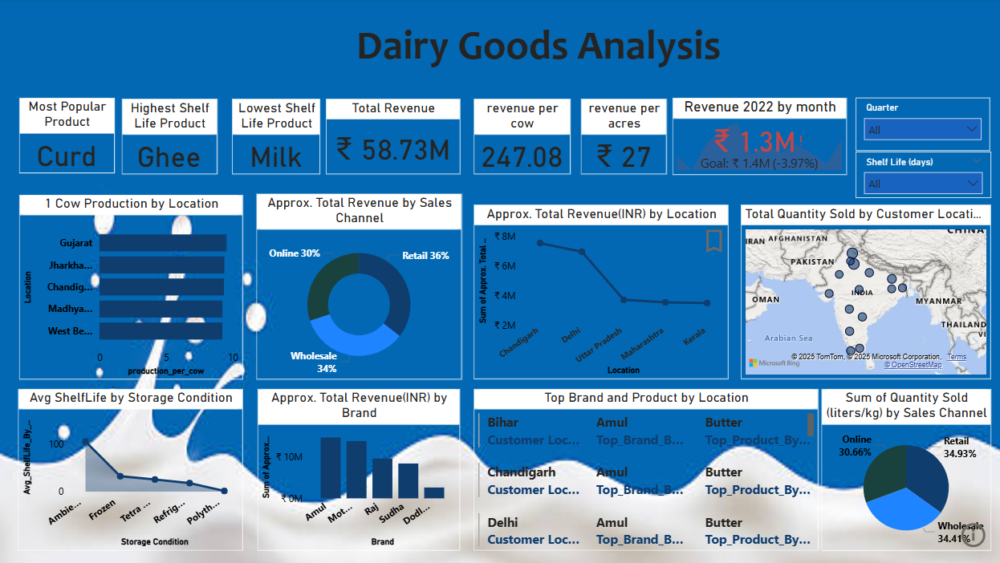

# 🧀 Dairy Goods Analysis Dashboard

## 📋 Executive Summary
This dashboard provides a detailed analysis of dairy product performance across Indian states, sales channels, and storage conditions. It highlights key metrics such as revenue, shelf life, product popularity, and geographic distribution. The goal is to support data-driven decisions in production, marketing, and supply chain management for dairy businesses.

---

## ❗ Business Problem
Dairy producers face challenges in:
- Identifying top-performing products and regions
- Managing shelf life across varying storage conditions
- Optimizing sales channels for maximum profitability
- Understanding customer demand by location

This analysis aims to uncover actionable insights to improve operational efficiency and revenue generation.

---

## 🔍 Methodology
- Aggregated sales, shelf life, and production data across multiple dimensions
- Built interactive visualizations (bar, pie, line, map) to explore trends
- Enabled dynamic filtering by quarter, sales channel, and shelf life
- Conducted comparative analysis across locations and brands

---

## 🛠️ Skills & Tools Used
- **Data Visualization**: Power BI / Tableau
- **Data Analysis**: SQL, Excel, Python
- **Business Intelligence**: KPI tracking, performance benchmarking
- **Geospatial Mapping**: Regional production and sales distribution
- **Dashboard Design**: UX-focused layout for clarity and interactivity

---
## 📊 Dashboard Preview  
  

## 📈 Results
- **Most Popular Product**: Curd  
- **Highest Shelf Life**: Ghee  
- **Lowest Shelf Life**: Milk  
- **Total Revenue**: ₹58.73M  
- **Revenue per Cow**: ₹247.08  
- **Revenue per Acre**: ₹27  
- **Sales Channel Split**: Wholesale (61%), Online (39%)  
- **Top Performing States**: Gujarat, Maharashtra, Karnataka  
- **2022 Monthly Revenue**: ₹1.3M (Goal: ₹1.41M, 3.97% below target)

---

## ✅ Recommendations
- Increase production and promotion of high shelf life products like ghee
- Invest in digital marketing to boost online sales
- Expand operations in high-performing regions such as Gujarat and Maharashtra
- Optimize storage conditions to extend shelf life, especially for milk
- Monitor KPIs monthly to stay aligned with revenue goals and adjust strategy proactively

